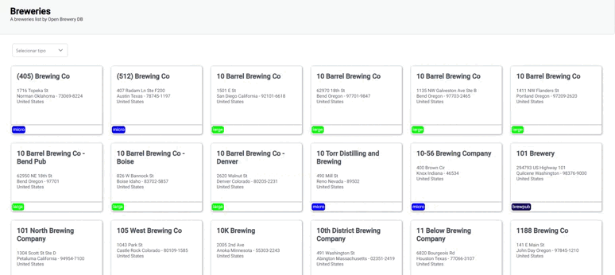

<h1 align="center">Open Brewery</h1>

  <a href="#-tecnologias">Tecnologias</a>&nbsp;&nbsp;&nbsp;|&nbsp;&nbsp;&nbsp;
  <a href="#-projeto">Projeto</a>&nbsp;&nbsp;&nbsp;|&nbsp;&nbsp;&nbsp;
  <a href="#-redes">Redes</a>

  

---

## 🚀 Tecnologias

Esse projeto foi desenvolvido com as seguintes tecnologias:

- Angular
- Typescript
- PrimeNG

## 💻 Projeto

O projeto consiste em uma rota com três páginas com uma lista de cartões com todas as cervejarias e algumas de suas propriedades. Ao executar a ação de clique em algum dos cartões, é direcionado para uma rota onde terá mais propriedades da respectiva cervejaria. Foi utilizado um dos conceitos do SOLID, que é a inversão de dependência, ao qual gostei bastante de trabalhar.

Utilizado:

- Componentização front-end
- Componentes dinâmicos que recebem parâmetros
- Inversão de dependência
- Services
- Diretivas
- Rotas
- Lazy Loading

---

## 🔗 Redes

Estas são minhas redes sociais. Sinta-se a vontade para mandar uma mensagem.

- [Linkedin](https://www.linkedin.com/in/eomgn/)
- [Instagram](https://www.instagram.com/matheuzngr/)
- [Twitter](https://twitter.com/eomgn)
